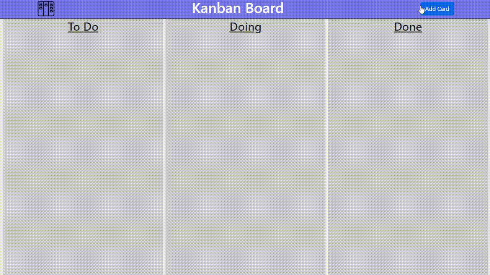

# Kanban Project

### About the project  
Kanban is a workflow management method that helps organizations manage and improve work systems. This project is the creation of a Kanban's template.

### Objective
The Objective of this project is the learn and practice the use of HTML, CSS, JavaScript and Bootstrap on the creation of a web page.

### How to run
In order to run the project, the user has to download the "kanban_project" folder, contaning the index.html, style.css and script.js files and the assets folder. Then, open index.html file on web browser.

### How to use 
The Kanban system is based on cards that are distribuited on sections.
- To create these cards, the user has to click the "Add Card" button. It will be added to the "To Do" section; 
- The card's text content is editable, so the user can describe the task.
- Every card is draggable, so the user can move it to whichever section he wants to.

### Technologies Used
- HTML;
- CSS;
- JavaScript;
- Bootstrap.